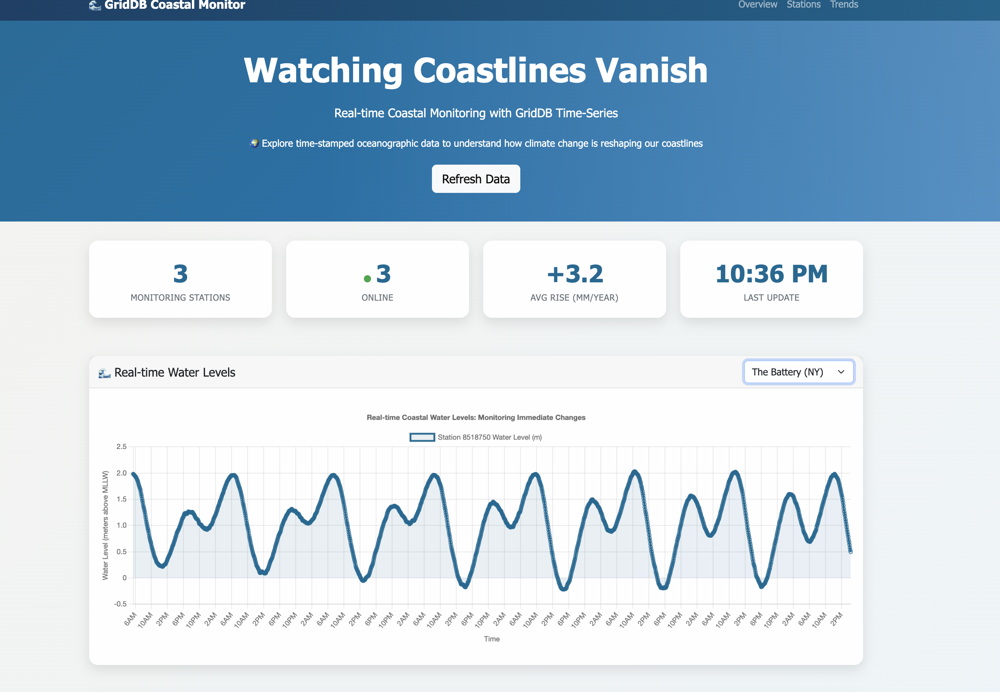
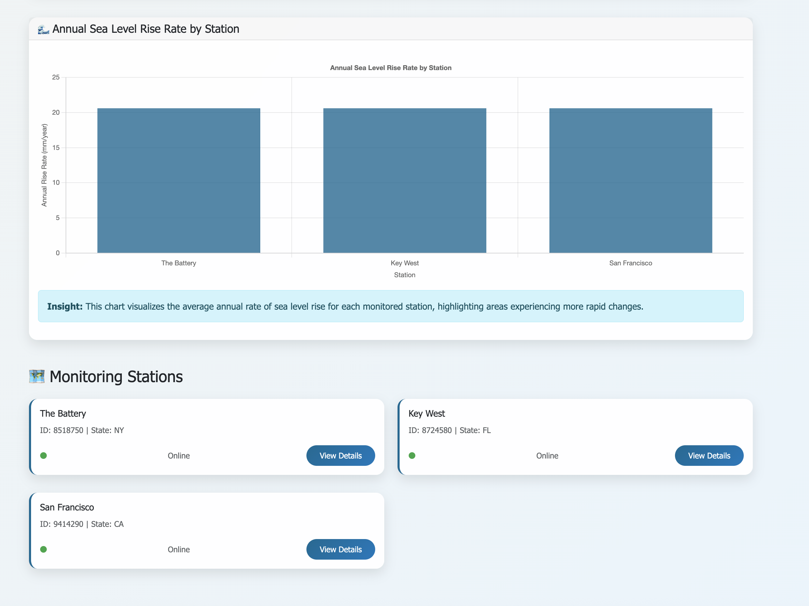
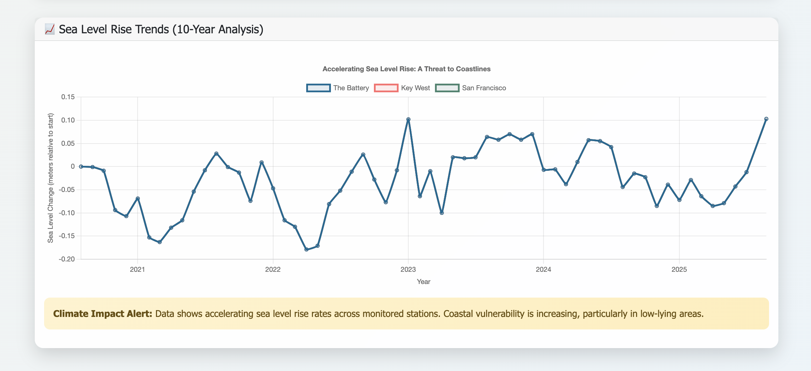

# **Advanced Time-Series Analytics for Coastal Climate Resilience: Implementing Real-Time Sea Level Monitoring with GridDB**

## **Introduction**

Global climate change is accelerating sea level rise at an alarming rate—averaging 3.3mm per year due to ocean warming and ice melt—posing severe threats to coastal communities and infrastructure. The complex dynamics of tides, storm surges, and long-term sea level trends require advanced, real-time monitoring systems that can handle vast streams of temporal data with precision and speed.

This guide details the deployment of a robust time-series database using GridDB's efficient columnar storage, integrated with NOAA's oceanographic APIs, to build a scalable platform for coastal vulnerability assessment. We'll walk through designing a high-throughput data ingestion pipeline that converts raw tidal data into practical insights, empowering proactive climate adaptation efforts.

## **Why GridDB for Time-Series in Coastal Monitoring?**

GridDB is an excellent choice for managing time-series data in coastal resilience projects because of its specialized features that handle high-volume, time-sensitive information effectively. Here's why it stands out, explained in simple terms:

- **Speedy Data Handling**: GridDB uses storage system that's optimized for quick reads and writes, making it ideal for processing millions of real-time sea level readings from sensors without slowdowns—crucial during fast-changing events like storms.

- **Scalability for Big Data**: It can easily scale to store and query massive datasets from sources like NOAA APIs, allowing coastal monitoring systems to grow as more sensors are added without losing performance.

- **Time-Series Focus**: Built-in support for timestamp-based queries lets you analyze trends over time (e.g., daily tides vs. yearly rises) efficiently, turning raw data into useful forecasts for flood risks or erosion.

- **Cost-Effective Integration**: Easy to connect with tools like APIs and analytics software, reducing setup time and costs for building end-to-end systems that support climate adaptation decisions.

## **Oceanographic Data Pipeline Architecture**

Contemporary coastal monitoring systems require ingestion and correlation of multiple oceanographic data streams to provide comprehensive situational awareness. Our implementation targets three primary data categories:

**Real-Time Hydrostatic Measurements**: High-frequency water level observations captured via pressure transducers and acoustic sensors, providing minute-resolution temporal data for immediate hazard detection and tidal analysis.

**Statistical Aggregations**: Monthly mean sea level calculations derived from harmonic tidal constituent analysis, essential for identifying long-term trends and separating anthropogenic signals from natural oceanographic cycles.

**Geospatial Station Metadata**: Comprehensive sensor network topology information including geographic coordinates, operational status, calibration parameters, and data quality metrics.

The NOAA Tides and Currents API ecosystem provides standardized access to these data streams:

- **Instantaneous Water Level Service**: `https://tidesandcurrents.noaa.gov/api/datagetter` configured with high-resolution temporal sampling parameters
- **Long-Term Statistical Trends**: Monthly aggregation endpoints providing climatological baseline data
- **Network Topology Service**: `https://tidesandcurrents.noaa.gov/mdapi/v1.0/webapi/stations` delivering comprehensive sensor metadata

## **GridDB Cloud Infrastructure Configuration**

### **Set Up GridDB Cloud**

For this exercise, we will be using GridDB Cloud vesion. Start by visiting the [GridDB Cloud](https://griddb.net/en/) portal and [signing up]([GridDB Cloud Free Plan | TOSHIBA DIGITAL SOLUTIONS CORPORATION](https://form.ict-toshiba.jp/download_form_griddb_cloud_freeplan_e?utm_source=griddbnet&utm_medium=topbanner)) for an account.


Based on requirements, either the free plan or a paid plan can be selected for broader access. After registration ,an email will be sent containing essential details, including the Web API URL and login credentials.

Once the login details are received, log in to the Management GUI to access the cloud instance.

## **Application Properties Configuration**

The `application.properties` file located in `src/main/resources` is crucial for configuring the application's connection to GridDB Cloud and other external services. Here's an example of the properties you would typically configure:

```properties
# GridDB Cloud Connection Properties
griddb.rest.url=YOUR_GRIDDB_CLOUD_WEB_API_URL
griddb.api.key=YOUR_GRIDDB_CLOUD_API_KEY
griddb.cluster.name=YOUR_CLUSTER_NAME
griddb.username=YOUR_USERNAME
griddb.password=YOUR_PASSWORD

# NOAA API Base URL (if applicable, for data fetching)
noaa.api.base.url=https://tidesandcurrents.noaa.gov/api/datagetter
```

Replace the placeholder values (`YOUR_GRIDDB_CLOUD_WEB_API_URL`, `YOUR_GRIDDB_CLOUD_API_KEY`, etc.) with your actual GridDB Cloud credentials and cluster details. These properties ensure the application can securely connect to and interact with your GridDB instance.

### **Development Environment Architecture**

```shell
└───my-griddb-app
    ├───pom.xml
    ├───src
    │   ├───main
    │   │   ├───java
    │   │   │   └───com
    │   │   │       └───griddb
    │   │   │           └───coastal
    │   │   │               ├───CoastalMonitorApplication.java
    │   │   │               ├───controller
    │   │   │               │   └───DashboardController.java
    │   │   │               ├───model
    │   │   │               │   ├───MonthlyMeanData.java
    │   │   │               │   ├───StationMetadata.java
    │   │   │               │   └───WaterLevelData.java
    │   │   │               └───service
    │   │   │                   ├───DataSchedulerService.java
    │   │   │                   ├───GridDBService.java
    │   │   │                   ├───NOAADataService.java
    │   │   │                   └───RestTemplateConfig.java
    │   │   └───resources
    │   │       ├───application.properties
    │   │       └───templates
    │   │           └───dashboard.html
    └───target
        └───... (compiled classes, jar, etc.)
```

### 

#### **Maven Dependency Integration**

Configure the project build system with GridDB client libraries:

```xml
<project xmlns="http://maven.apache.org/POM/4.0.0"
  xmlns:xsi="http://www.w3.org/2001/XMLSchema-instance"
  xsi:schemaLocation="http://maven.apache.org/POM/4.0.0 http://maven.apache.org/maven-v4_0_0.xsd">
  <modelVersion>4.0.0</modelVersion>
  <groupId>com.example</groupId>
  <artifactId>my-griddb-app</artifactId>
  <version>1.0-SNAPSHOT</version>
  <name>my-griddb-app</name>
  <url>http://maven.apache.org</url>

  <parent>
    <groupId>org.springframework.boot</groupId>
    <artifactId>spring-boot-starter-parent</artifactId>
    <version>3.2.4</version>
    <relativePath /> <!-- lookup parent from repository -->
  </parent>

  <properties>
    <maven.compiler.source>17</maven.compiler.source>
    <maven.compiler.target>17</maven.compiler.target>
  </properties>

  <dependencies>
    <dependency>
      <groupId>org.springframework.boot</groupId>
      <artifactId>spring-boot-starter-actuator</artifactId>
    </dependency>

    <dependency>
      <groupId>org.springframework.boot</groupId>
      <artifactId>spring-boot-starter-web</artifactId>
      <exclusions>
        <exclusion>
          <groupId>org.springframework.boot</groupId>
          <artifactId>spring-boot-starter-logging</artifactId>
        </exclusion>
      </exclusions>
    </dependency>
    <dependency>
      <groupId>org.springframework.boot</groupId>
      <artifactId>spring-boot-starter-test</artifactId>
      <scope>test</scope>
    </dependency>
    <dependency>
      <groupId>org.springframework.boot</groupId>
      <artifactId>spring-boot-starter-thymeleaf</artifactId>
    </dependency>
    <!-- JSON processing -->
    <dependency>
      <groupId>org.glassfish.jersey.core</groupId>
      <artifactId>jersey-client</artifactId>
      <version>2.35</version>
    </dependency>
    <dependency>
      <groupId>org.json</groupId>
      <artifactId>json</artifactId>
      <version>20210307</version>
    </dependency>
    <dependency>
      <groupId>com.fasterxml.jackson.core</groupId>
      <artifactId>jackson-databind</artifactId>
      <version>2.15.0</version> <!-- or the latest version -->
    </dependency>
    <!-- Lombok -->
    <dependency>
      <groupId>org.projectlombok</groupId>
      <artifactId>lombok</artifactId>
      <optional>true</optional>
    </dependency>
  <dependency>
      <groupId>jakarta.annotation</groupId>
      <artifactId>jakarta.annotation-api</artifactId>
      <version>2.1.1</version>
    </dependency>
  </dependencies>
  <build>
    <plugins>
      <plugin>
        <groupId>org.apache.maven.plugins</groupId>
        <artifactId>maven-compiler-plugin</artifactId>
        <configuration>
          <annotationProcessorPaths>
            <path>
              <groupId>org.projectlombok</groupId>
              <artifactId>lombok</artifactId>
              <version>${lombok.version}</version>
            </path>
          </annotationProcessorPaths>
        </configuration>
      </plugin>
    </plugins>
  </build>
</project>
```

#### **GridDB Container Architecture**

Our implementation leverages three specialized Time Series Containers optimized for different temporal characteristics and query patterns:

**Primary Time-Series Container (coastal_water_level)**
Designed for high-frequency sensor data ingestion with microsecond timestamp precision:

- `timestamp` (TIMESTAMP) - Primary temporal index with automatic partitioning
- `station_id` (STRING) - Composite index for spatial queries  
- `station_name` (STRING) - Human-readable station identifier
- `water_level` (DOUBLE) - Calibrated measurement in specified datum
- `datum` (STRING) - Vertical reference system (MLLW, MSL, NAVD88)
- `latitude` (DOUBLE) - WGS84 decimal degrees
- `longitude` (DOUBLE) - WGS84 decimal degrees
- `flags` (STRING) - Quality control and sensor status indicators

**Statistical Aggregation Container (coastal_monthly_mean)**
Optimized for climatological analysis and trend detection:

- `month` (TIMESTAMP) - Monthly temporal partitioning key
- `station_id` (STRING) - Station correlation index
- `station_name` (STRING) - Station metadata
- `mean_sea_level` (DOUBLE) - Statistically processed monthly average
- `year` (INTEGER) - Temporal grouping field
- `month_number` (INTEGER) - Numerical month for seasonal analysis
- `latitude` (DOUBLE) - Geospatial coordinates
- `longitude` (DOUBLE) - Geospatial coordinates

**Metadata Container (coastal_stations)**
Station configuration and operational status tracking:

- `station_id` (STRING) - Unique station identifier
- `station_name` (STRING) - Official station designation
- `state` (STRING) - Administrative geographic region
- `latitude` (DOUBLE) - Precise geographic positioning
- `longitude` (DOUBLE) - Precise geographic positioning  
- `region` (STRING) - Oceanographic zone classification
- `is_active` (BOOL) - Operational status flag
- `last_updated` (TIMESTAMP) - Maintenance tracking

## **Real-Time Data Ingestion Pipeline**

The heart of any real-time monitoring system lies in its ability to efficiently collect and process incoming data streams. For our coastal monitoring solution, this means seamlessly integrating with authoritative sources like NOAA to capture critical oceanographic measurements as they happen.

### **NOAA API Integration Service**

To ensure our system always has the most up-to-date information on sea levels and coastal conditions, we've developed a dedicated service for interacting with NOAA's comprehensive APIs. This service is designed for resilience, handling network fluctuations and data retrieval with robust error management, ensuring a continuous flow of vital data into our system.

```java
package com.griddb.coastal.service;

import com.griddb.coastal.model.WaterLevelData;
import com.griddb.coastal.model.MonthlyMeanData;
import com.griddb.coastal.model.StationMetadata;
import org.json.JSONArray;
import org.json.JSONObject;
import org.slf4j.Logger;
import org.slf4j.LoggerFactory;
import org.springframework.beans.factory.annotation.Value;
import org.springframework.stereotype.Service;

import java.io.BufferedReader;
import java.io.InputStreamReader;
import java.net.HttpURLConnection;
import java.net.URL;
import java.time.LocalDate;
import java.time.LocalDateTime;
import java.time.format.DateTimeFormatter;
import java.util.*;

@Service
public class NOAADataService {

    private static final Logger logger = LoggerFactory.getLogger(NOAADataService.class);

    @Value("${noaa.api.base.url}")
    private String noaaBaseUrl;

    @Value("${noaa.api.metadata.url}")
    private String noaaMetadataUrl;

    @Value("${noaa.api.application}")
    private String applicationName;

    @Value("${noaa.stations}")
    private String stationsConfig;

    private Map<String, StationMetadata> stationCache = new HashMap<>();

    /**
     * Fetch latest water level data for a station
     */
    public List<WaterLevelData> fetchLatestWaterLevels(String stationId) {
        List<WaterLevelData> waterLevels = new ArrayList<>();

        try {
            String urlStr = String.format("%s?product=water_level&application=%s&station=%s&date=latest&datum=MLLW&time_zone=gmt&units=metric&format=json",
                    noaaBaseUrl, applicationName, stationId);

            logger.info("Fetching latest water levels from: {}", urlStr);

            String response = makeHttpRequest(urlStr);
            JSONObject jsonResponse = new JSONObject(response);

            if (jsonResponse.has("data")) {
                JSONArray dataArray = jsonResponse.getJSONArray("data");
                StationMetadata station = getOrFetchStationMetadata(stationId);

                for (int i = 0; i < dataArray.length(); i++) {
                    JSONObject dataPoint = dataArray.getJSONObject(i);

                    // NOAA format: {"t": "yyyy-MM-dd HH:mm", "v": "x.xxx", "f": "..."}
                    String timestamp = dataPoint.getString("t");
                    double waterLevel = Double.parseDouble(dataPoint.getString("v"));
                    String flags = dataPoint.optString("f", "");

                    LocalDateTime dateTime = LocalDateTime.parse(timestamp, 
                        DateTimeFormatter.ofPattern("yyyy-MM-dd HH:mm"));

                    WaterLevelData wld = new WaterLevelData(
                        stationId, 
                        station.getStationName(),
                        dateTime,
                        waterLevel,
                        "MLLW",
                        station.getLatitude(),
                        station.getLongitude(),
                        flags
                    );
                    waterLevels.add(wld);
                }
            }

            logger.info("Fetched {} water level readings for station {}", waterLevels.size(), stationId);

        } catch (Exception e) {
            logger.error("Error fetching water level data for station {}: {}", stationId, e.getMessage());
        }

        return waterLevels;
    }

    /**
     * Fetch historical water level data (last 7 days)
     */
    public List<WaterLevelData> fetchRecentWaterLevels(String stationId, int days) {
        List<WaterLevelData> waterLevels = new ArrayList<>();

        try {
            LocalDate endDate = LocalDate.now();
            LocalDate startDate = endDate.minusDays(days);

            String urlStr = String.format("%s?product=water_level&application=%s&station=%s&begin_date=%s&end_date=%s&datum=MLLW&time_zone=gmt&units=metric&format=json",
                    noaaBaseUrl, applicationName, stationId, 
                    startDate.format(DateTimeFormatter.ofPattern("yyyyMMdd")),
                    endDate.format(DateTimeFormatter.ofPattern("yyyyMMdd")));

            logger.info("Fetching recent water levels from: {}", urlStr);

            String response = makeHttpRequest(urlStr);
            JSONObject jsonResponse = new JSONObject(response);

            if (jsonResponse.has("data")) {
                JSONArray dataArray = jsonResponse.getJSONArray("data");
                StationMetadata station = getOrFetchStationMetadata(stationId);

                for (int i = 0; i < dataArray.length(); i++) {
                    JSONObject dataPoint = dataArray.getJSONObject(i);

                    String timestamp = dataPoint.getString("t");
                    double waterLevel = Double.parseDouble(dataPoint.getString("v"));
                    String flags = dataPoint.optString("f", "");

                    LocalDateTime dateTime = LocalDateTime.parse(timestamp, 
                        DateTimeFormatter.ofPattern("yyyy-MM-dd HH:mm"));

                    WaterLevelData wld = new WaterLevelData(
                        stationId, 
                        station.getStationName(),
                        dateTime,
                        waterLevel,
                        "MLLW",
                        station.getLatitude(),
                        station.getLongitude(),
                        flags
                    );
                    waterLevels.add(wld);
                }
            }

            logger.info("Fetched {} historical water level readings for station {}", waterLevels.size(), stationId);

        } catch (Exception e) {
            logger.error("Error fetching recent water level data for station {}: {}", stationId, e.getMessage());
        }

        return waterLevels;
    }

    /**
     * Fetch monthly mean data for long-term trend analysis
     */
    public List<MonthlyMeanData> fetchMonthlyMeanData(String stationId, int years) {
        List<MonthlyMeanData> monthlyData = new ArrayList<>();

        try {
            LocalDate endDate = LocalDate.now();
            LocalDate startDate = endDate.minusYears(years);

            String urlStr = String.format("%s?product=monthly_mean&application=%s&station=%s&begin_date=%s&end_date=%s&datum=MSL&time_zone=gmt&units=metric&format=json",
                    noaaBaseUrl, applicationName, stationId, 
                    startDate.format(DateTimeFormatter.ofPattern("yyyyMMdd")),
                    endDate.format(DateTimeFormatter.ofPattern("yyyyMMdd")));

            logger.info("Fetching monthly mean data from: {}", urlStr);

            String response = makeHttpRequest(urlStr);
            JSONObject jsonResponse = new JSONObject(response);

            if (jsonResponse.has("data")) {
                JSONArray dataArray = jsonResponse.getJSONArray("data");
                StationMetadata station = getOrFetchStationMetadata(stationId);

                for (int i = 0; i < dataArray.length(); i++) {
                    JSONObject dataPoint = dataArray.getJSONObject(i);

                    // NOAA format: {"year": "YYYY", "month": "MM", "MSL": "x.xxx"}
                    int year = Integer.parseInt(dataPoint.getString("year"));
                    int monthNumber = Integer.parseInt(dataPoint.getString("month"));
                    double meanLevel = Double.parseDouble(dataPoint.getString("MSL"));

                    LocalDate month = LocalDate.of(year, monthNumber, 1);

                    MonthlyMeanData mmd = new MonthlyMeanData(
                        stationId,
                        station.getStationName(),
                        month,
                        meanLevel,
                        year,
                        monthNumber,
                        station.getLatitude(),
                        station.getLongitude()
                    );
                    monthlyData.add(mmd);
                }
            }

            logger.info("Fetched {} monthly mean readings for station {}", monthlyData.size(), stationId);

        } catch (Exception e) {
            logger.error("Error fetching monthly mean data for station {}: {}", stationId, e.getMessage());
        }

        return monthlyData;
    }

    /**
     * Get configured monitoring stations
     */
    public List<StationMetadata> getConfiguredStations() {
        List<StationMetadata> stations = new ArrayList<>();

        String[] stationConfigs = stationsConfig.split(";");
        for (String config : stationConfigs) {
            String[] parts = config.split(",");
            if (parts.length >= 6) {
                StationMetadata station = StationMetadata.builder()
                    .stationId(parts[0].trim())
                    .stationName(parts[1].trim())
                    .state(parts[2].trim())
                    .latitude(Double.parseDouble(parts[3].trim()))
                    .longitude(Double.parseDouble(parts[4].trim()))
                    .isActive(Boolean.parseBoolean(parts[5].trim()))
                    .build();
                stations.add(station);
            }
        }

        return stations;
    }

    /**
     * Get or fetch station metadata
     */
    private StationMetadata getOrFetchStationMetadata(String stationId) {
        if (stationCache.containsKey(stationId)) {
            return stationCache.get(stationId);
        }

        // Return default station info if not in cache
        StationMetadata station = StationMetadata.builder()
            .stationId(stationId)
            .stationName("Station " + stationId)
            .latitude(40.0) // Default coordinates
            .longitude(-74.0)
            .build();
        stationCache.put(stationId, station);

        return station;
    }

    /**
     * Make HTTP request to NOAA API
     */
    private String makeHttpRequest(String urlStr) throws Exception {
        URL url = new URL(urlStr);
        HttpURLConnection conn = (HttpURLConnection) url.openConnection();
        conn.setRequestMethod("GET");
        conn.setRequestProperty("User-Agent", "GridDB-CoastalMonitor/1.0");

        int responseCode = conn.getResponseCode();
        if (responseCode != 200) {
            throw new RuntimeException("HTTP Error: " + responseCode);
        }

        BufferedReader reader = new BufferedReader(new InputStreamReader(conn.getInputStream()));
        StringBuilder response = new StringBuilder();
        String line;

        while ((line = reader.readLine()) != null) {
            response.append(line);
        }
        reader.close();

        String responseStr = response.toString();
        logger.info("NOAA API Response for {}: {}", urlStr, responseStr);
        if (responseStr.trim().isEmpty()) {
            return "{}";
        }
        return responseStr;
    }
}
```

### **Data Transformation and Persistence Layer**

Once raw data is acquired, it must be  prepared for storage and analysis. This layer is dedicated to transforming the diverse incoming data into a standardized, clean, and enriched format, ensuring its integrity and usability within GridDB.

The NOAA APIs provide data in various JSON structures. Before this data can be effectively stored and utilized in GridDB, it undergoes a  transformation process. This ensures consistency, handles potential missing values, and converts raw measurements into a format optimized for our time-series database.

Example NOAA API response structure:

```json
{
  "metadata": {
    "id": "8518750",
    "name": "The Battery", 
    "lat": "40.7012",
    "lon": "-74.0137",
    "url": "https://tidesandcurrents.noaa.gov/stationhome.html?id=8518750"
  },
  "data": [
    {
      "t": "2025-08-23 10:00",
      "v": "0.193", 
      "s": "0.000",
      "f": "0,0,0,0",
      "q": "p"
    }
  ]
}
```

The ingestion service performs automatic data type conversions, handles missing values through interpolation algorithms, and maintains data lineage for audit trails.

For persistence, the transformed data is stored in GridDB using its REST-based API. Each record is written into a time-series container. The REST API allows applications to send JSON payloads directly to GridDB, where the data is indexed by timestamp and made available for queries and analysis.

## **Interactive Visualization and Analytics Dashboard**

A powerful monitoring system is incomplete without a clear and intuitive way to visualize its data. Our interactive dashboard transforms raw oceanographic measurements into actionable insights, providing a dynamic view of coastal changes and trends. The dashboard retrieves data directly from GridDB, which efficiently serves time-series queries, ensuring that visualizations update quickly as new measurements arrive.

### **Web Application Controller Layer**

The presentation tier implements RESTful endpoints serving both human-readable dashboards and machine-readable APIs for external system integration:

```java
package com.griddb.coastal.controller;

import com.griddb.coastal.service.NOAADataService;
import com.griddb.coastal.service.GridDBService;
import com.griddb.coastal.service.DataSchedulerService;
import com.griddb.coastal.model.StationMetadata;
import org.json.JSONArray;
import org.json.JSONObject;
import org.slf4j.Logger;
import org.slf4j.LoggerFactory;
import org.springframework.beans.factory.annotation.Autowired;
import org.springframework.http.ResponseEntity;
import org.springframework.stereotype.Controller;
import org.springframework.ui.Model;
import org.springframework.web.bind.annotation.*;

import java.util.List;

@Controller
public class DashboardController {

    private static final Logger logger = LoggerFactory.getLogger(DashboardController.class);

    @Autowired
    private NOAADataService noaaDataService;

    @Autowired
    private GridDBService gridDBService;

    @Autowired
    private DataSchedulerService schedulerService;

    /**
     * Main dashboard page
     */
    @GetMapping("/")
    public String dashboard(Model model) {
        logger.info("Rendering main dashboard");

        List<StationMetadata> stations = noaaDataService.getConfiguredStations();
        model.addAttribute("stations", stations);
        model.addAttribute("title", "Watching Coastlines Vanish");
        model.addAttribute("subtitle", "Real-time Coastal Monitoring with GridDB Time-Series");

        return "dashboard";
    }

    /**
     * Get latest water levels for a specific station (JSON API)
     */
    @GetMapping("/api/water-levels/{stationId}")
    @ResponseBody
    public ResponseEntity<String> getWaterLevels(@PathVariable String stationId, 
                                               @RequestParam(defaultValue = "24") int hours) {
        try {
            String data = gridDBService.queryLatestWaterLevels(stationId, hours);
            return ResponseEntity.ok(data);
        } catch (Exception e) {
            logger.error("Error fetching water levels for station {}: {}", stationId, e.getMessage());
            return ResponseEntity.internalServerError().body("{"error": "" + e.getMessage() + "}");
        }
    }

    /**
     * Get monthly trends for sea level rise analysis (JSON API)
     */
    @GetMapping("/api/monthly-trends/{stationId}")
    @ResponseBody
    public ResponseEntity<String> getMonthlyTrends(@PathVariable String stationId,
                                                  @RequestParam(defaultValue = "10") int years) {
        try {
            String data = gridDBService.queryMonthlyTrends(stationId, years);
            return ResponseEntity.ok(data);
        } catch (Exception e) {
            logger.error("Error fetching monthly trends for station {}: {}", stationId, e.getMessage());
            return ResponseEntity.internalServerError().body("{"error": "" + e.getMessage() + "}");
        }
    }

    /**
     * Get all stations metadata (JSON API)
     */
    @GetMapping("/api/stations")
    @ResponseBody
    public ResponseEntity<List<StationMetadata>> getAllStations() {
        try {
            List<StationMetadata> stations = noaaDataService.getConfiguredStations();
            return ResponseEntity.ok(stations);
        } catch (Exception e) {
            logger.error("Error fetching stations: {}", e.getMessage());
            return ResponseEntity.internalServerError().build();
        }
    }

    /**
     * Get aggregated data for all stations dashboard
     */
    @GetMapping("/api/dashboard-data")
    @ResponseBody
    public ResponseEntity<String> getDashboardData() {
        try {
            JSONObject dashboardData = new JSONObject();
            JSONArray stationsData = new JSONArray();

            List<StationMetadata> stations = noaaDataService.getConfiguredStations();

            for (StationMetadata station : stations) {
                JSONObject stationInfo = new JSONObject();
                stationInfo.put("stationId", station.getStationId());
                stationInfo.put("stationName", station.getStationName());
                stationInfo.put("state", station.getState());
                stationInfo.put("latitude", station.getLatitude());
                stationInfo.put("longitude", station.getLongitude());

                // Get latest water level
                String latestDataString = gridDBService.queryLatestWaterLevels(station.getStationId(), 1);
                JSONObject latestDataObject = new JSONObject(latestDataString);
                stationInfo.put("latestWaterLevel", latestDataObject);

                // Get monthly trend (last 2 years for quick overview)
                String trendDataString = gridDBService.queryMonthlyTrends(station.getStationId(), 2);
                JSONObject trendDataObject = new JSONObject(trendDataString);
                logger.info("Monthly Trend Data for {}: {}", station.getStationId(), trendDataObject.toString());
                stationInfo.put("monthlyTrend", trendDataObject);

                stationsData.put(stationInfo);
            }

            dashboardData.put("stations", stationsData);
            dashboardData.put("lastUpdated", System.currentTimeMillis());
            dashboardData.put("totalStations", stations.size());

            return ResponseEntity.ok(dashboardData.toString());

        } catch (Exception e) {
            logger.error("Error generating dashboard data: {}", e.getMessage());
            return ResponseEntity.internalServerError().body("{"error": "" + e.getMessage() + "}");
        }
    }

    /**
     * Manual data collection trigger (for testing/admin)
     */
    @PostMapping("/api/trigger-collection")
    @ResponseBody
    public ResponseEntity<String> triggerDataCollection() {
        try {
            schedulerService.triggerDataCollection();
            JSONObject response = new JSONObject();
            response.put("status", "success");
            response.put("message", "Data collection triggered successfully");
            response.put("timestamp", System.currentTimeMillis());

            return ResponseEntity.ok(response.toString());
        } catch (Exception e) {
            logger.error("Error triggering data collection: {}", e.getMessage());
            return ResponseEntity.internalServerError().body("{"error": "" + e.getMessage() + "}");
        }
    }

    /**
     * Manual monthly data update trigger
     */
    @PostMapping("/api/trigger-monthly-update")
    @ResponseBody
    public ResponseEntity<String> triggerMonthlyUpdate() {
        try {
            schedulerService.triggerMonthlyUpdate();
            JSONObject response = new JSONObject();
            response.put("status", "success");
            response.put("message", "Monthly data update triggered successfully");
            response.put("timestamp", System.currentTimeMillis());

            return ResponseEntity.ok(response.toString());
        } catch (Exception e) {
            logger.error("Error triggering monthly update: {}", e.getMessage());
            return ResponseEntity.internalServerError().body("{"error": "" + e.getMessage() + "}");
        }
    }

    /**
     * Health check endpoint
     */
    @GetMapping("/api/health")
    @ResponseBody
    public ResponseEntity<String> healthCheck() {
        JSONObject health = new JSONObject();
        health.put("status", "UP");
        health.put("application", "Coastal Monitor");
        health.put("timestamp", System.currentTimeMillis());
        health.put("griddb", "Connected");
        health.put("noaa", "Available");

        return ResponseEntity.ok(health.toString());
    }
}
```

The dashboard retrieves data from GridDB using paging-based REST APIs, which allow large time-series datasets to be read in smaller chunks. This makes queries efficient and ensures the visualizations can update smoothly as new measurements arrive.

## **Application Deployment**

### **Build and Execution Pipeline**

Deploy the complete monitoring system using Maven's integrated build lifecycle:

```shell
mvn clean install && mvn spring-boot:run 
```

Access the operational dashboard through standard HTTP protocols: `http://localhost:8080/`. Once the system is running, it continuously fetches live data and updates the dashboards with real-time insights.

This chart displays real-time and historical water level data, providing a clear visualization of coastal conditions. Specifically, it shows:

- **Real-time Water Level (m)**: Instantaneous water level measurements over time, reflecting current tidal and environmental conditions. This data is crucial for immediate hazard detection, such as storm surges and unusually high tides, allowing for timely warnings and emergency responses to protect coastal communities and infrastructure.
- **Monthly Mean Water Level (m)**: The average monthly sea level, which helps in identifying long-term trends and assessing sea level rise. By analyzing these long-term trends, coastal planners and scientists can understand the rate of sea level rise, predict future impacts, and develop strategies for climate adaptation, including land-use planning, infrastructure development, and ecosystem restoration. The combination of real-time and historical data provides a comprehensive view, enabling both immediate operational decisions and long-term strategic planning for coastal resilience.







## **Conclusion**

This project demonstrates how GridDB effectively monitors coastal changes in real-time. By integrating with NOAA's data streams and processing millions of sea level measurements, the system converts raw data into actionable insights on evolving coastlines. GridDB's strength lies in managing time-series data at scale, avoiding traditional databases' performance issues, and enabling trend detection and anomaly identification during storms—delivering essential information for coastal planners.

As sea levels rise and storms intensify, reliable data access is vital for infrastructure and emergency decisions. The GridDB solution shows that environmental challenges can be addressed effectively with the right tool, without unnecessary complexity.
